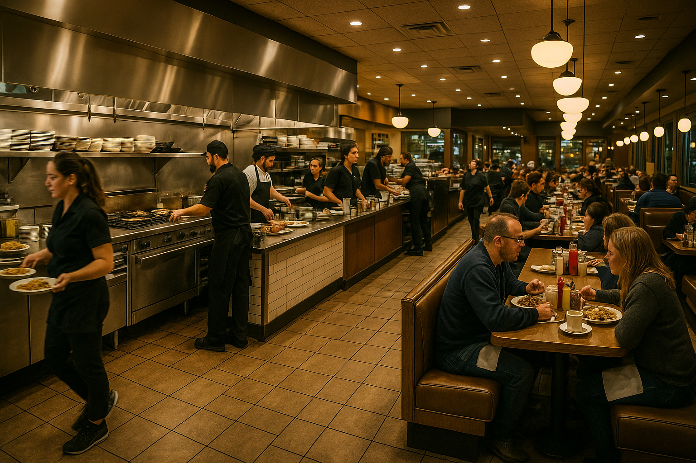

# 🍽️ Restaurant Order Analysis (MySQL Project)
## 📌 Project Overview

A MySQL-based analysis of restaurant operations to understand menu performance, customer behavior, order volume, and business insights.

##  📁 Files Included

SQL_Query/ → All SQL scripts used for analysis

Restaurant_Operations_Analysis_SQL_Query.docx → Full analysis with SQL queries

Restaurant_Insight_Summary.pdf → Final business insights (client-friendly)

Restaurant-Operations-Analysis-Requirement.pptx → Client requirement presentation

Restaurant.png → Project banner/image

##  🎯 Project Goals

Analyze menu pricing, best-selling items, and low performers

Understand customer order patterns and spending behavior

Identify high-value orders, group orders, and premium categories

Provide business-friendly insights to improve operations

##  📊 Key Insights

American dishes → highest order volume

Italian dishes → highest revenue (premium items)

Group orders → strong opportunity for combos/bundles

Least-ordered items (e.g., Edamame) need review

##  🛠 Operational Improvements

Optimize menu (promote best sellers, review poor performers)

Improve inventory planning (reduce waste, maintain stock)

Run targeted marketing (American daily deals, Italian specials)

Offer family/group combos for large orders

##  🧠 Business Recommendations

Add high-margin combo offers

Improve menu layout & visuals

Create loyalty rewards for frequent customers

Introduce seasonal promotions (Italian Week, Grill Day, etc.)

##  📈 Data Recommendations

Track monthly trends and seasonality

Analyze profitability per dish

Segment customers (families, repeat buyers, high spenders)

Maintain a weekly dashboard for operations

##  🔧 Tools Used

MySQL Workbench

Excel

PowerPoint

Python (ReportLab) for PDF generation

## 👤 Author

Dharmesh Parmar
Data Analyst / Business Analyst
📧 dhparmar2119@gmail.com

## 📸 Project Banner

